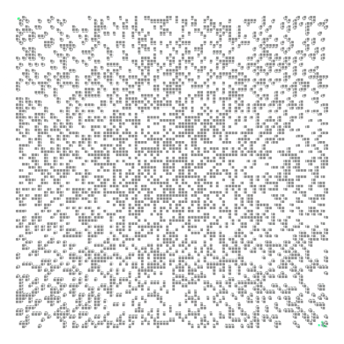

# AI Algorithms and Apps based OpenGL

  

## Introduction

This repo includes gaming apps and algorithms such as BFS, DFS, A-Star in order to create AI bots to compete with each other. Each project introduces a different type of routing algorithm as the ones introduced before.

A link to download the final project of this repo is attached as follows:
https://drive.google.com/file/d/1eNxYD-qTMtjc9h6Wo4sTZRzslanKd3KG/view?usp=sharing

## Requirements

* OpenGL
* Visual Studio
